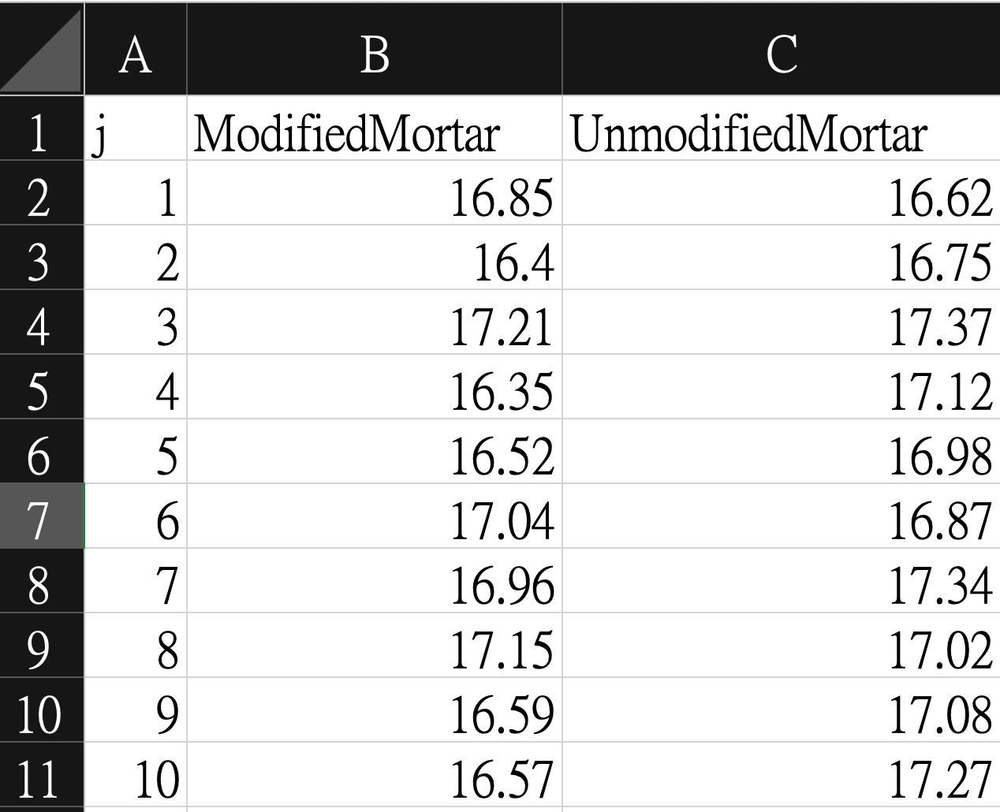
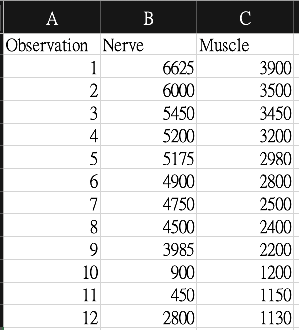
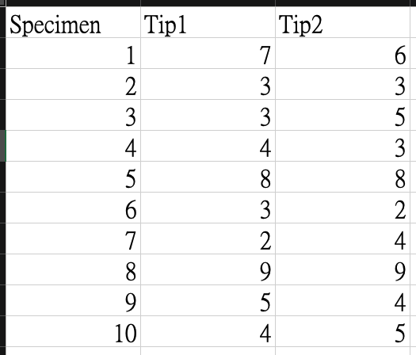

```{r setup, include=FALSE}
knitr::opts_chunk$set(echo = TRUE)
```

Textbook: Montgomery, D. C. (2012). *Design and analysis of experiments*, 8th Edition. John Wiley & Sons.

Online handouts: https://github.com/PingYangChen/ANOVA_Course_R_Code

<!--
## Know the meaning of the significant level

```{r, eval=TRUE, echo=TRUE}
n_sim <- 1000
mu <- 0
sig <- 1.5
mu_0 <- 0
n <- 30
pvals <- numeric(n_sim)
for (i in 1:n_sim) {
  set.seed(i)
  x <- rnorm(n, mu, sig)
  z <- (mean(x) - mu_0)/(sig/sqrt(n))
  pvals[i] <- pnorm(z)
}
sum(pvals < 0.05)/n_sim
```
-->

# Chapter 2

## Data Description and Visualization

The Tension Bond Strength Data is collected from the Portland Cement Formulation Experiment. For small dataset, one can directly create a dataframe in R,
```{r, eval=TRUE, echo=TRUE}
df1 <- data.frame(
  j = 1:10,
  ModifiedMortar = c(
    16.85, 16.4, 17.21, 16.35, 16.52, 
    17.04, 16.96, 17.15, 16.59, 16.57
  ),
  UnmodifiedMortar = c(
    16.62, 16.75, 17.37, 17.12, 16.98, 
    16.87, 17.34, 17.02, 17.08, 17.27
  )
)
```

or create an csv file to store the data and then read it in R.
```{r, echo=FALSE, fig.align='center', out.width='30%', fig.cap='Tension Bond Strength Data'}

```

```{r, eval=TRUE, echo=TRUE}
df1 <- read.csv(file.path("data", "2_TensionBondStrength.csv"))
```

Descrptive statistics are enssential when observing a dataset. In R, basic functions `mean()`, `median()`, `min()`, `max()`, `quantile()` and etc computes the central tendency of an univariate variable. There are also functions for computing the variation of an univariate variable, such as `var()`, `sd()`, `IQR()` and `range()`. The `summary()` function combines several of these statistics into one function call.

```{r, eval=TRUE, echo=TRUE, fig.align='center'}
summary(df1)
```

The quick and direct approach to examine the existence of the difference between the response of two treatments (groups, levels of a factor) is to use graphs. The most common way is to draw to boxplots for the response values of each treatment.

```{r, eval=TRUE, echo=TRUE, fig.align='center', fig.width=4}
# Transform the dataset from wide layout to long layout
library(reshape2)
df1_L <- stack(df1, select = c("ModifiedMortar","UnmodifiedMortar"))
colnames(df1_L) <- c("Strength", "Mortar")
# Draw the grouped boxplot
boxplot(Strength ~ Mortar, data = df1_L)
```

\newpage
## R Function of t-tests

```{r, eval=FALSE}
t.test(x, y = NULL,
       alternative = c("two.sided", "less", "greater"),
       mu = 0, paired = FALSE, var.equal = FALSE,
       conf.level = 0.95, ...)
```

Syntax for different types of the t-test.

| Type of t-test                | `x`     | `y`     | `var.equal` | `paried` |
| ----------------------------- | ------- | ------- | ----------- | -------- |
| One-sample                    | Numeric | `NULL`  | --          | --       |
| Two-sample (equal variance)   | Numeric | Numeric | `TRUE`      | `FALSE`  |
| Two-sample (unequal variance) | Numeric | Numeric | `FALSE`     | `FALSE`  |
| Paired                        | Numeric | Numeric | --          | `TRUE`   |


## One-sample t-test

Suppose the goal is to determine whether the strength of the cement made by the modified Mortar formula is greater than 16.5 or not. Let $\mu$ be the population mean of the strength of the cement using modified Mortar formula. The hypothesis is
$$
H_0: \mu = 16.5 \text{ vs. } H_1: \mu > 16.5
$$

Under significance level $\alpha = 0.05$, we perform the one-sample t-test as the following code.
```{r, eval=TRUE, echo=TRUE, fig.align='center'}
t.test(df1$ModifiedMortar, y = NULL,
       alternative = "greater",
       mu = 16.5)
```
The test shows that the p-value is 0.02699 which is less than $\alpha$, and therefore we reject $H_0$. That is, the mean of the population of the strength of the modified Mortar formula is greater than 16.5.


\newpage
## Two-sample t-test for Equal Variance

Let $\mu_1$ be the population mean of the strength of the cement using modified Mortar formula, and $\mu_2$ be the population mean of the strength of the cement using original Mortar formula.
The experimenter is investigating on the difference of the strengths between the two Mortar formula, the modified one and the original one. The hypothesis is
$$
H_0: \mu_1 = \mu_2 \text{ vs. } H_1: \mu_1 \neq \mu_2
$$

First, we need to identify the proper type of the two-sample t-test by examining the equality of variances of the two set of the data.

```{r, eval=TRUE, echo=TRUE, fig.align='center'}
cat(sprintf(
  "The std.dev. of the strength data of the modified Mortar is %.4f 
The std.dev. of the strength data of the original Mortar is %.4f",
  sd(df1$ModifiedMortar), sd(df1$UnmodifiedMortar)
))
```

The standard deviations of these groups seems to be different. We can further check for the equality of variance using F-test. If independent
random samples of size $n_1$ and $n_2$ are taken from populations 1 and 2, respectively, to test for the equality of variance of two Normal populations, 
the test statistic for
$$
H_{V0}: \sigma^2_1 = \sigma^2_2 \text{ vs. } H_{V1}: \sigma^2_1 \neq \sigma^2_2
$$
is the ratio of the sample variances
$$
F_0 = \frac{S_1^2}{S_2^2}
$$
Under $H_{V0}$, $F_0$ follows the $F$ distribution with $n_1-1$ numerator
degrees of freedom and $n_2-1$ denominator degrees of freedom. Given the significance level $\alpha$, We reject $H_{V0}$ if $F_0 > F_{\alpha/2, n_1-1, n_2-1}$ or if $F_0 < F_{1-\alpha/2, n_1-1, n_2-1}$. In R, we use the function `var.test`.
```{r, eval=TRUE, echo=TRUE, fig.align='center'}
var.test(df1$ModifiedMortar, df1$UnmodifiedMortar,
         alternative = "two.sided")
```
The F-test shows a large p-value, 0.4785, and hence, we do not reject $H_{V0}$. That is, there is no evidence to conclude the variances of the two populations, strength of modified and original Mortar, are different.

Then, we know that we are using two-sample t-test under equal variance setting.
For significance level $\alpha = 0.05$, we set `var.equal = TRUE` and perform the two-sample t-test as the following code.
```{r, eval=TRUE, echo=TRUE, fig.align='center'}
t.test(df1$ModifiedMortar, df1$UnmodifiedMortar,
       alternative = "two.sided",
       paired = FALSE, var.equal = TRUE)
```
The test shows that the p-value is 0.0422 which is less than $\alpha$, and therefore we reject $H_0$. That is, the means of the population of the strength of the modified and original Mortar formula are different. The estimated mean strength difference is $\bar{X}_1 - \bar{X}_2 = 16.764 - 17.042 = -0.278$  (`mean(df1$ModifiedMortar) - mena(df1$UnmodifiedMortar)`).

According to the QQ plots, Normality check for the data is passed because, for the observations in each treatment, most of the data points on the QQ plots are closed to the straight line. The equality of variance could be confirmed due to the slopes of the lines on two plots are similar.

```{r, eval=TRUE, echo=TRUE, fig.align='center'}
par(mfrow=c(1,2))
qqnorm(df1$ModifiedMortar, main = "QQ Plot of Modified Mortar")
qqline(df1$ModifiedMortar, col = "red")
qqnorm(df1$UnmodifiedMortar, main = "QQ Plot of Unmodified Mortar")
qqline(df1$UnmodifiedMortar, col = "red")
```

\newpage
## Two-sample t-test for Unequal Variances

The dataset in this subsection is collected from an experiment of the use of a fluorescently labeled peptide that assists the identification of the nerves. The response variable is the normalized fluorescence two hours after the injection.
```{r, echo=FALSE, fig.align='center', out.width='30%', fig.cap='Normalized Fluorescence After Two Hours'}

```

```{r, eval=TRUE, echo=TRUE}
df2 <- data.frame(
  Observation = 1:12,
  Nerve = c(
    6625, 6000, 5450, 5200, 5175, 4900, 
    4750, 4500, 3985, 900, 450, 2800
  ),
  Muscle = c(
    3900, 3500, 3450, 3200, 2980, 2800, 
    2500, 2400, 2200, 1200, 1150, 1130
  )
)
```

```{r, eval=TRUE, echo=TRUE}
df2 <- read.csv(file.path("data", "2_Fluorescence.csv"))
```

Let $\mu_1$ be the population mean of fluorescence of the nerve, and $\mu_2$ be the population mean of fluorescence of the muscle. To confirm the existence of the difference between the fluorescence of nerve and muscle, the hypothesis is
$$
H_0: \mu_1 = \mu_2 \text{ vs. } H_1: \mu_1 \neq \mu_2
$$

First, we examine the equality of variances of the two set of the data.
```{r, eval=TRUE, echo=TRUE, fig.align='center'}
cat(sprintf(
  "The std.dev. of the fluorescence of the nerve is %.4f 
The std.dev. of the fluorescence of the muscle is %.4f",
  sd(df2$Nerve), sd(df2$Muscle)
))
```
The standard deviations are quite different. The inequality of the variance of the two populations is confirm by the F-test:
$$
H_{V0}: \sigma^2_1 = \sigma^2_2 \text{ vs. } H_{V1}: \sigma^2_1 \neq \sigma^2_2
$$
where $\sigma^2_1$ represents the variance of the population of the fluorescence of the nerve and $\sigma^2_2$ represents that of the fluorescence of the muscle.
```{r, eval=TRUE, echo=TRUE, fig.align='center'}
var.test(df2$Nerve, df2$Muscle,
         alternative = "two.sided")
```
The F-test reports the p-value being 0.03052 which is less than the siginificace level $\alpha=0.05$. Therefore, $H_{V0}$ is rejected and we confirm that the variances of the two populations, fluorescence of the nerve ad the muscle, are different.

Then, the two-sample t-test for unequal variance is used.
For significance level $\alpha = 0.05$, we set `var.equal = FALSE` and perform the two-sample t-test as the following code.
```{r, eval=TRUE, echo=TRUE, fig.align='center'}
t.test(df2$Nerve, df2$Muscle,
       alternative = "two.sided",
       paired = FALSE, var.equal = FALSE)
```
The test shows that the p-value is 0.01456 which is less than $\alpha$, and therefore we reject $H_0$. That is, the means of the population of the fluorescence of the nerve and the muscle are different. The estimated mean fluorescence difference is $\bar{X}_1 - \bar{X}_2 = 4227.917  2534.167 = 1693.75$  (`mean(df2$Nerve) - mena(df2$Muscle)`).

According to the QQ plots, Normality check for the data is passed because, for the observations in each treatment, most of the data points on the QQ plots are closed to the straight line. By comparing the two QQ plots, we can also confirm the data in each treatment are of unequal variance by observing different slopes of the straight lines.
```{r, eval=TRUE, echo=TRUE, fig.align='center'}
par(mfrow=c(1,2))
qqnorm(df2$Nerve, main = "QQ Plot of nerve")
qqline(df2$Nerve, col = "red")
qqnorm(df2$Muscle, main = "QQ Plot of muscle")
qqline(df2$Muscle, col = "red")
```

\newpage
## Paired t-test

Two tips are both available to be used on the hardness testing machine and they should produce similar hardness testing results. However, the experimenter now suspect that the measurements made by two tips on the testing machine seems to be different. 
The dataset in this subsection is the depth measurements of the depression of 10 metal specimens caused by two different tips of the hardness testing machine. 
```{r, echo=FALSE, fig.align='center', out.width='30%', fig.cap='Data for the Hardness Testing Experiment'}

```

```{r, eval=TRUE, echo=TRUE}
df3 <- data.frame(
  Specimen = 1:10,
  Tip1 = c(7, 3, 3, 4, 8, 3, 2, 9, 5, 4),
  Tip2 = c( 6, 3, 5, 3, 8, 2, 4, 9, 4, 5)
)
```

```{r, eval=TRUE, echo=TRUE}
df3 <- read.csv(file.path("data", "2_Hardness.csv"))
```

The goal is to find out is there any difference between the test results made by the two tips. Let $\mu_1$ be the population mean of hardness reading of tip 1, and $\mu_2$ be the population mean of hardness reading of tip 2.

The 10 specimens are expected to be of different hardness due to uncontrolled variables during their manufacturing process. This lack of homogeneity between specimens will contribute to the variability of the hardness measurements and will tend to inflate the experimental error, thus making a true difference between tips harder to detect.

The paired t-test is used to determine whether the difference between two tips is zero or not. By testing on the nonzeroness of the difference, the effect on the hardness caused by the specimens can be neglected. Define $d_j = y_{1j} - y_{2j}$ where $y_{ij}$ is the hardness measurement of the $i$th specimen and $j$th tip. The population mean of this difference is denoted by $\mu_d$. The hypothesis of the paired t-test is
$$
H_0: \mu_d = 0 \text{ vs. } H_1: \mu_d \neq 0
$$

For significance level $\alpha = 0.05$, we set `paired = TRUE` and perform the paired t-test as the following code.
```{r, eval=TRUE, echo=TRUE, fig.align='center'}
t.test(df3$Tip1, df3$Tip2,
       alternative = "two.sided",
       paired = TRUE)
```
The test shows that the p-value is 0.7976 which is greater than $\alpha$, and therefore we do not reject $H_0$. That is, there is no evidence to confirm the non-zero mean of the population of the difference between measurements of two tips.

Normality check is needed. I skip the assumption checking process here due to redundancy.